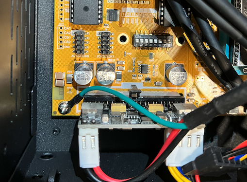
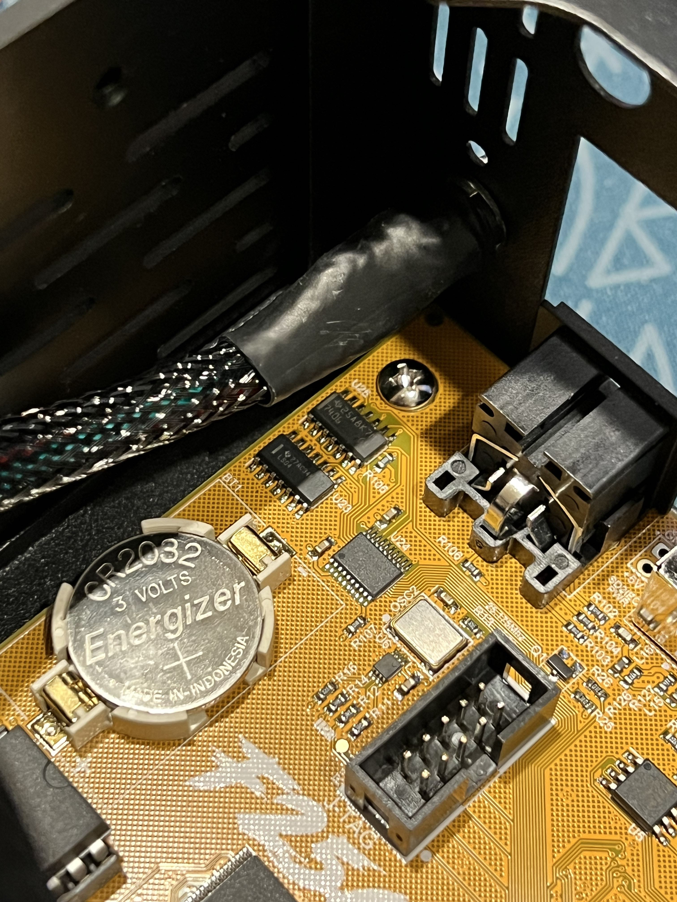
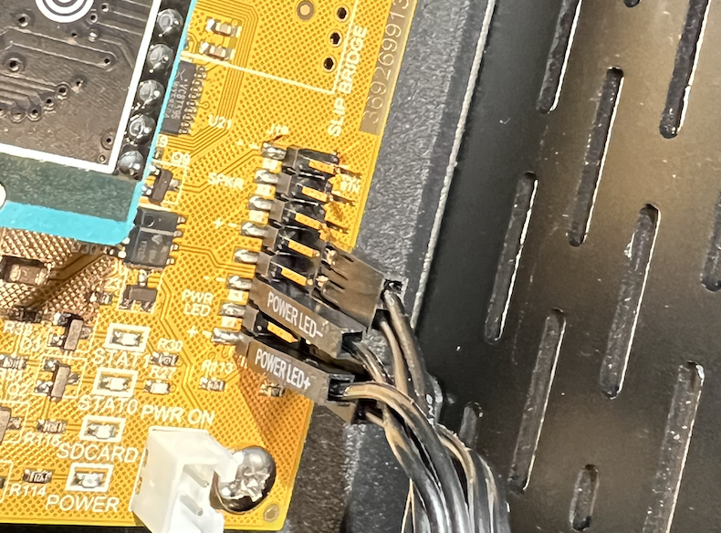
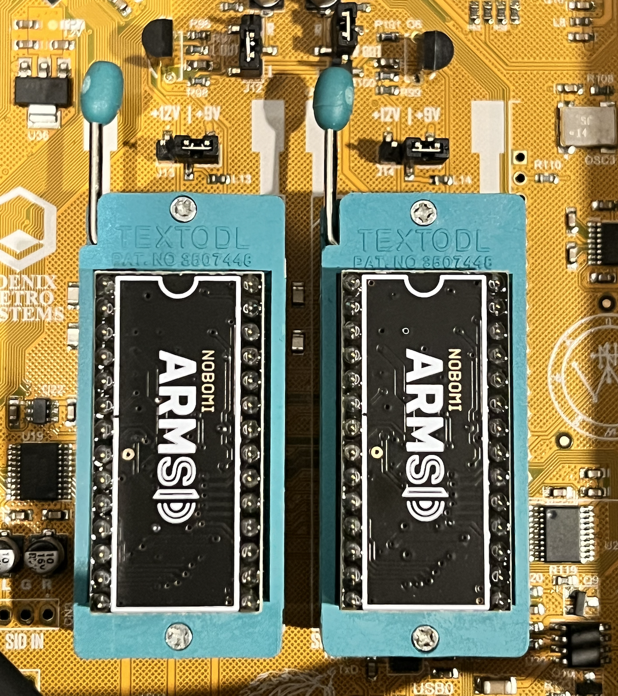
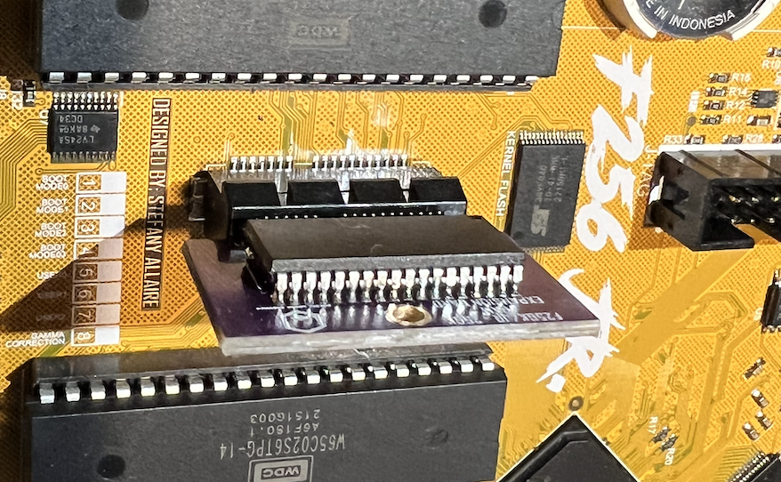
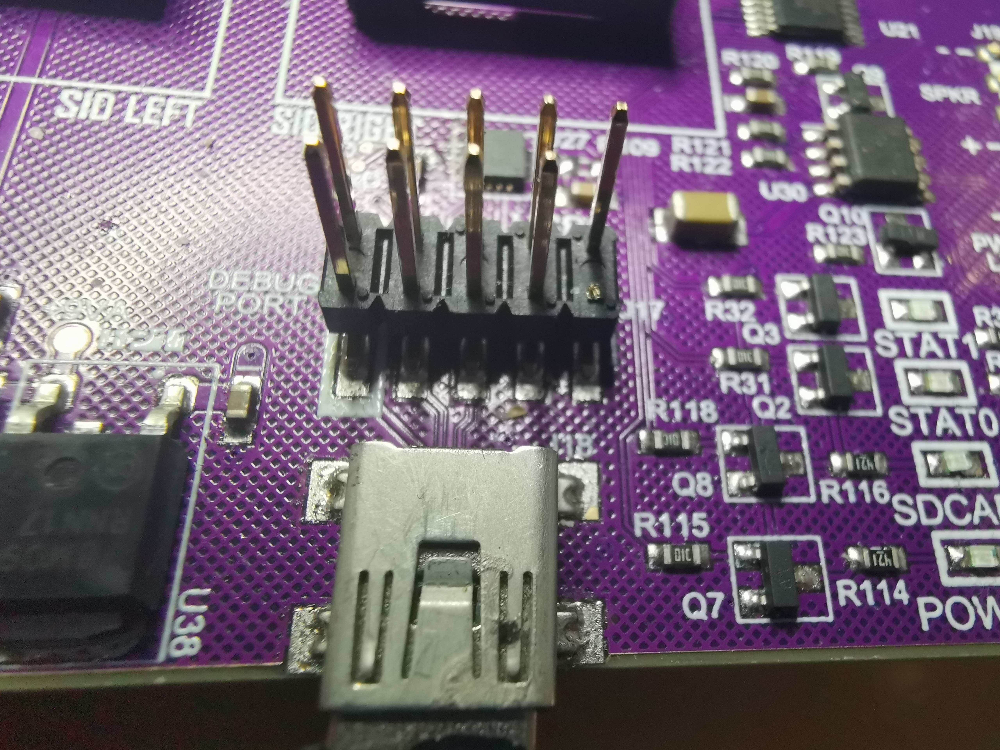
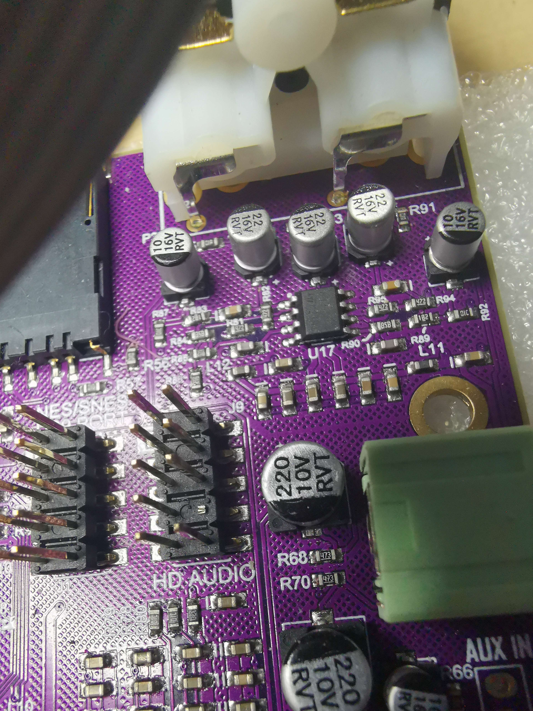

# Setting up the F256JR 

The Junior (JR) is distributed as a bare main board.  You'll need (at a mininum)

- a MiniITX case
- 24 pin ATX power supply (PSU)
- PS/2 compatible keyboard
- DVI capable display

Familiarize yourself with the [board layout](images/F256-Jr-Specs-OneSheeter.png).

## MiniITX case

In theory, any MiniITX case should work.   This [metal option from Amazon](https://www.amazon.com/dp/B07GYP2TWC) looks nice and is well construcuted, several builders have used it.   If you want to use the built-in USB ports of the case, double check the connector types.  USB 2.0 port connectors on a motherboard are typically 9 pin style (DR10 = Dual Row Header 10 pins, with a "key" pin cut to prevent connector being attached backwards).   If the case has 20 pin USB 3.0 style motherboard connectors, buy a [converter like this one](https://www.amazon.com/gp/product/B084D58HBP).

You can really put your own flair on the case design, as demonstrated by [a more advanced & custom example here](https://github.com/pig-games/F256-Jr-System-Case).

## 24 pin ATX power supply (PSU)

Since the JR needs very little power, a PicoPSU works well and is small and easy to work with.  In theory any compatible supply could be use though.

- [Pico PSU](https://www.amazon.com/dp/B08F57GKCL) (runs off of a 12V DC center positive input source)
- [12V DC center positive A/C adapter](https://www.amazon.com/dp/B07MXXXBV8) - use this to power the Pico PSU

## PS/2 Keyboard

The JR needs a PS/2 keyboard and uses the traditional purple 6-pin DIN PS/2 port.  You can opt for a known good modern PS/2 board, like the [Perixx PERIBOARD-409P](https://www.amazon.com/dp/B00JV08TIA).  

There are also USB based boards that are "PS/2 compatible".  These are a bit of a hybrid as when these boards are put into PS/2 mode, they emit PS/2 signaling over a physical USB port.   You would need to use the appropriate purple USB to PS/2 adapter, [like this one](https://www.amazon.com/gp/product/B09WV5JMKS).  Note that you need the purple adapters, not the green ones which are wired differently for a mouse.

USB keyboards that support a "PS/2" mode were more common during the transition era between the standards and most modern USB keyboards are not going to work.   The Agon Light project maintains a [list of some USB keyboards that are known to support a PS/2 mode](https://docs.google.com/spreadsheets/d/1-6_sz6l-vJW5rFg3M0Y6bwC0hmFS7U6PPNjIZ9plrM8/edit).

Notably, there are still some very high end, modern USB keyboards that are made which continue to have a PS/2 mode, like the [Niz Plum x87 2021](https://www.nizkeyboard.com/products/niz-2019-new-x87-electro-capacitive-bluetooth-keyboard-non-rgb-white-black) (hold 'FN' + Backspace keys down until keyboard reboots to enable PS/2 mode).

## DVI 

The JR (and the K) have a DVI output for video.  Either use a DVI montior, or buy a reasonable converter:

- [DVI -> HDMI cable](https://www.amazon.com/Amazon-Basics-Adapter-Cable-1-Pack/dp/B014I8UL8U/)
- [DVI -> VGA adapter](https://www.amazon.com/DTECH-Female-Adapter-DVI-I-Converter/dp/B07MSGX355)

## Optional Pieces

### Debug USB port connector

You will definitely want access to the debug USB port as this is the primary way to do cross development for the device.  If you put the mainboard into a standard case, the clearance for the debug USB port on the front of the board is limited.   Either you an [L shaped connector like this one](https://www.amazon.com/StarTech-com-USBAMB2MD-Mini-Cable-Cord/dp/B00F2GR2H6), or use the [9-pin motherboard style connector](https://www.amazon.com/BAIRONG-Motherboard-Adapter-Female-Dupont/dp/B09B1VGCDR/).  As discussed above, if the case comes with 20-pin style USB3.0 connectors for its built in ports, use a [converter like this one](https://www.amazon.com/gp/product/B084D58HBP).

### Joystick ports

There are two Atari-style joystick connectors (2x DR10) and a 3rd DR10 port for the NES/SNES adapter.   For all 3 ports, you'll need a connector like [this one](https://www.amazon.com/StarTech-com-Serial-Motherboard-Header-Panel/dp/B0067DB6RU/) to get a DB9 port.  For the Atari joystick ports, you can then connect the joysticks directly to the DB9.  The NES/SNES adapter port is intended to be used with the [DB9 ended FNX4N4S adapter](https://c256foenix.com/product/fnx4n4s/?v=7516fd43adaa) -- which allows the connection of up to 4 NES or SNES gamepads.  Note due to the format and voltage levels of this port, simply connecting a single Japanese-style SNES controller with a DB9 style cable will not work.  

### Sound output

The JR has both standard RCA jacks for stereo audio as well as a 3.5mm headphone port.  The RCA jacks are easily accessible from the exposed ports on the back if the board is put into a case.  The 3.5mm headphone port is more challenging, you may want to use an [L connector like this one](https://www.amazon.com/Gold-Plated-Connector-Compatible-Controller-Speakers/dp/B07YFBCQTT/).

### SID chips (Commodore sound)

The JR has two SID slots for SID chips, but they do not come populated (note: the K effectively includes the 2 SID chips, although they are implemented by the onboard FPGA and are not user replaceable).   Both 9V and 12V SID chips are supported (by jumper).  If you need to buy SID chips, you can buy used stock or one of the new replacements like BackSID, SwinSID, or ARM SID.

- [ARM SID from RetroComp.CZ](https://www.retrocomp.cz/produkt?id=2)

### RTC Battery

The F256 line sports a battery backed real-time clock (RTC) that will keep the time & date over restarts.  It's powered by a [3V CR2023](https://www.amazon.com/AmazonBasics-CR2032-Lithium-Coin-Cell/dp/B0787K2XWZ/) battery.

### Case port cover / back plate

The recommended case above doesn't come with a backplate / port cover.  You can leave the back of the case open, or:

- Buy a [universal back plate](https://www.amazon.com/IOmesh-Black-Universal-Shield-Plate/dp/B08NWFQXMJ/) and cut it.
- 3D print [the back IO panel](archive/Back_Bezel_F256Jr_RevB0A.stl).

### ESP8266 Wi-Fi Feather

The F256 line can be expanded to support TCP/IP over Wi-Fi, using an ESP8266.  Doing this is a somewhat involved and requires soldering.   See details here at the [wiki here](https://wiki.c256foenix.com/index.php?title=F256_WiFi_Setup), and in this [explanation video](https://wiki.c256foenix.com/index.php?title=F256_WiFi_Setup).

# Assembly

- A best practice is to carefully install the Pico power module into the Jr. board BEFORE mounting in your case to avoid excessive board flex (flex can get ugly if you install the board first on its case stand-offs and then push down on it with force to insert cables).  The same applies to the SID sockets.

- Green wire from PicoPSU should be grounded, you can use a motherboard mounting screw to hold it down

- 12V connector from the PicoPSU can be attached to the back wall of the case with included washer.

- Insert CR2032 battery.

- Attach case LED and switch leads.  Connectors and associated pins are labeled.  NB: Recommended case above doesn't have a reset switch, but this doesn't impact operation (use power switch).

- Optional: Insert ZIF sockets into SID sockets, install SIDs into ZIFs

- Optional: Insert RAM expansion if applicable

### Rev C Only: Cut Key Pins

On some batch C boards, the "key" pin which is typically cut (and will be solid on the female side of the matched connector) was not cut.  Use an electronics wire cutter to remove the appropriate pin:

USB Header:

Audio Header:

# Next Steps

Read the [Quick Start guide](quick_start.md)!
